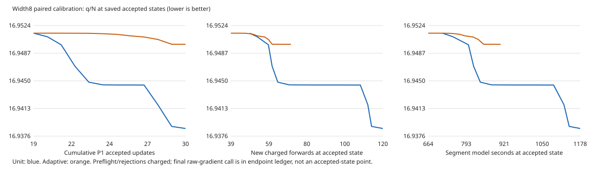

# Paired optimizer result: retain unit backtracking

Both arms completed the preregistered12 new updates from the identical saved
18-update width8 state, reaching30 cumulative portable P1 updates. Both used
the same source37eac1e, container, full2,290 observations, mu=1e-6, seed and
A6000 profile, concurrently on different GPUs of the same node. Both replay,
positivity, raw-gradient and saved-audit gates passed, with no supervisor stop.
This comparison is not based on unequally censored endpoints.

The [frozen design](../docs/P1_OPTIMIZER_CALIBRATION.md) required adaptive scaling
to retain q/N and penalized-objective progress while saving at least25% charged
new forwards. The [hash-verified executable decision](../analysis/p1-calibration-20260913-a01/decision.json)
selects **unit-backtracking**: adaptive passed the cost test but failed both
progress tests. Independent reviewer: `p1-saved-evidence-review-20260913`.

| Metric | Unit control | Adaptive scale |
|---|---:|---:|
| Endpoint q/N | 16.938637228982 | 16.949877882230 |
| Penalized objective | 8.469317279310 | 8.474937609610 |
| New accepted / cumulative accepted | 12 / 30 | 12 / 30 |
| Charged new forwards / VJPs | 121 / 19 | 72 / 15 |
| Cumulative forwards / VJPs | 322 / 40 | 273 / 36 |
| New infeasible candidates / line-search rejections | 51 / 55 | 10 / 10 |
| Segment model-window seconds | 1192.605 | 923.515 |
| Cumulative model-window seconds | 2379.990 | 2110.900 |
| Penalized / raw gradient maximum | 0.190615 / 0.190615 | 0.143225 / 0.143354 |
| Minimum raw prediction / fixed sigma | 0.000442806 | 0.00000353145 |

Adaptive used40.4959% fewer forwards, but its q/N was0.011240653248 worse
(allowed1e-4) and its objective0.005620330301 worse (allowed5e-5).
The lower adaptive gradient maximum is a real diagnostic, not grounds to
replace the preregistered joint rule. Neither arm satisfies the unchanged
21-state convergence gate. This single-parent optimizer test establishes
neither general optimizer superiority nor an architecture winner.

The [complete accepted-state CSV](../analysis/p1-calibration-20260913-a01/accepted-learning-curves.csv)
reports all12 steps per arm, accepted alpha, q/objective, gradient, charged
calls, rejections and elapsed work. Its points end before the final raw-gradient
call; the [endpoint ledger and full diagnostics](../analysis/p1-calibration-20260913-a01/endpoint-ledger-and-diagnostics.json)
include that call. Each arm spent37 forwards on its identical restart/directional
preflight; these remain charged. Final alpha was0.0625 for unit and0.00048828125
for adaptive. The plot interpolates only between saved accepted states; it does
not assert the objective of rejected candidates or free progress during setup.

Both sampled peak owned GPU memory was9.07GiB. Sampled worker RSS was1.29GiB
for unit and1.31GiB for adaptive. Scheduler job elapsed was22:43 and17:15,
respectively; queue, prelaunch validation, model-window and saved-audit clocks
are distinct. The archives retain job-level terminal accounting, not scheduler
step MaxRSS. Walltime is secondary here; the decision uses charged calls.

## Residual and nuisance qualifications

| Endpoint diagnostic | Unit | Adaptive |
|---|---:|---:|
| COMPASS raw RMS / fixed sigma | 4.966761 | 4.963534 |
| HERMES raw RMS / fixed sigma | 2.385467 | 2.395652 |
| DY raw RMS / fixed sigma | 3.614441 | 3.630384 |
| DY nuisance-adjusted RMS / fixed sigma | 2.228582 | 2.230090 |
| Experimental nuisance penalty | 133.133345 | 135.558667 |
| Numerical nuisance penalty | 2.933633 | 3.208137 |
| High-COMPASS188-row raw RMS / fixed sigma | 7.979799 | 7.979765 |

All188 high-COMPASS observations remain underpredicted in both arms. Large DY
normalization shifts remain (for example E772:6.922782 versus6.980609).
Neither the lower aggregate unit score nor the slight adaptive COMPASS RMS
advantage resolves these residual levels. All named nuisances, signed means,
counts, positivity and both convergence windows are retained in the diagnostics.
Zero and negative predictions are absent; DY profile closure errors are below
9e-12. No production model or uncertainty analysis is authorized by this result.

## Public plan update and next bounded work

Apply unit backtracking consistently to the common96-update P1 milestone for
widths8/16/24. Preserve the unit width8 endpoint at30 steps and its native
curvature/history/window; widths16/24 retain their verified38/28-step states.
Do not restart from scratch or spend the adaptive branch as if it were unit
progress. Carry all inherited calls/model time into each successor ledger.

Preregister the exact remaining66/58/68 updates, reviewed longer segments and
shared cumulative ceilings before new claims. Use independently scheduled
one-GPU cells, up to three total, with the qualified A6000 backend initially.
B200 promotion remains conditional on clean full-data execution checks.
At96 updates, publish common-update/call/time diagnostics and the unchanged
convergence test; a milestone is not a plateau. Continuing progress warrants
another explicitly bounded round; stalled progress warrants conditioning and
feasibility diagnosis before enlarging the architecture matrix. Repeat-seed,
paired-initialization width comparisons remain required for architecture choice.

The two immutable records link separately uploaded, downloaded-and-SHA-verified
full evidence archives: [unit](../results/calibration-w8-p1-unit-a01/calibration-w8-p1-unit-a01-e2245d062b5d.json)
and [adaptive](../results/calibration-w8-p1-adaptive-a01/calibration-w8-p1-adaptive-a01-63c238cc1d3b.json).
Historical P1 execution provenance also has a separate
[supplement release](https://github.com/zetanaut/tmd-global-fit-lab/releases/tag/p1-historical-provenance-20260913-a01);
it supplements those P1 attempts, not PORT, and replaces no original archive.
